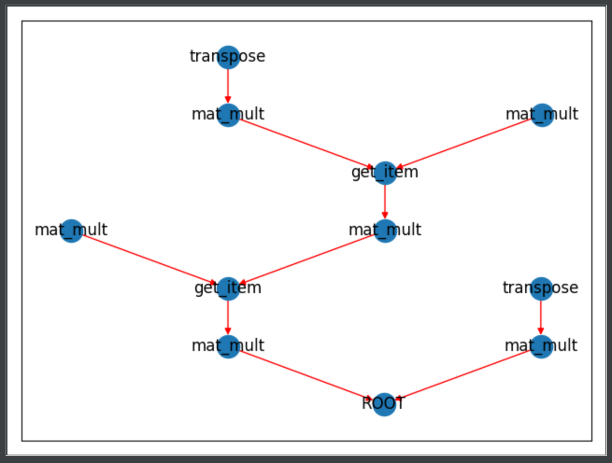

# MyAutogradExample



Simple example of Numerical Auto Differentiation inspired by PyTorch and Autograd

This is a full implementation of the Backpropagation algorithm used in a simple Feed Forward Neural Network that can achieve 65-75% prediction accuracy on the MINST
validation data set.

Backpropagation at the moment is very easily saturated, so early cut
off and checkpointing is almost necessary for achieving a good model.

This should not be used for anything beyond academic / personal interest.

FNN.py when ran, will train a Feed Forward Network on the MINST dataset using
the custom tensor class + backprop aglorithm to train the network.


# Goal

This project is slowly moving towards a fully functioning Deep Learning framework built solely for understanding of how
modern packages like PyTorch work.  

This means that this project will include a fully functional:
<ul>
    <li>Auto Differentiation for Back Propagation</li>
    <li>Modules of Neural Networks (similar to pytorches Linear/Conv2d/LSTM etc.)</li>
    <li>Optimizers like SGD and Adam</li>
    <li>Cost Functions like CrossEntropyLoss and MSE</li>
    <li>Various other subtle tools for building apt models (Regularization, Dropout, etc.)</li>
</ul>

Not sure how far this project will get - but with luck it will get far enough so that I can write documentation on 
how all this works on a granular level to help others understand these SOTA Deep Learning packages a bit better.

I am still not sure if this project will include anything with Tensor math or CUDA, although those are important...
 I would like to explore those topics but the primary focus is on how DL and its various algorithms work so for now
 everything runs on the CPU and the tensor class "Zensor" is really just a wrapper around Numpy.
 
# Autograd

More to come on this but for now, you can string together fairly large number of basic operations (defined in "autograd
/ functions / Functions.py" ) on a value wrapped in the Zensor class.  It will track the Computation Graph so that when
you call .backward on the Zensor, it will calculate the gradients of all input Zensors computed on.

If you want to visualize the computation graph you can!  

Here's a quick snippet to run autograd and visualize the graph


```python
import numpy as np
from zensor import Zensor
from autograd.visualization.GraphVis import *

# Easy way to define some arrays to use in the zensor
v1 = [1.,2.,3.,4.,5.,6.]
v2 = [6.,5.,4.,3.,2.,1.]
v3 = [3.,3.,3.]

m1 = np.array([v1]*3)
m2 = np.array([v2]*3)
m3 = np.array([v3]*1)
m4 = np.array([v3]*1)

# Initialize the Zensors as wrappers on the numpy arrays 
a = Zensor(m1)
b = Zensor(m2)
c = Zensor(m3)
d = Zensor(m4)

# Computation on the Zensors
y = a.transpose() @ b
z = (d @ y[0:3,:])[:,0:3] @ c.transpose()
z = z

# Show the graph of the computation done on Z
graph = build_computation_graph(z)
show(graph)

print(f'zensor z: {z}')

# Run backward on Zensor z, the grads of each Zensor used will be saved in {var_name}.grad
z.backward()
```

